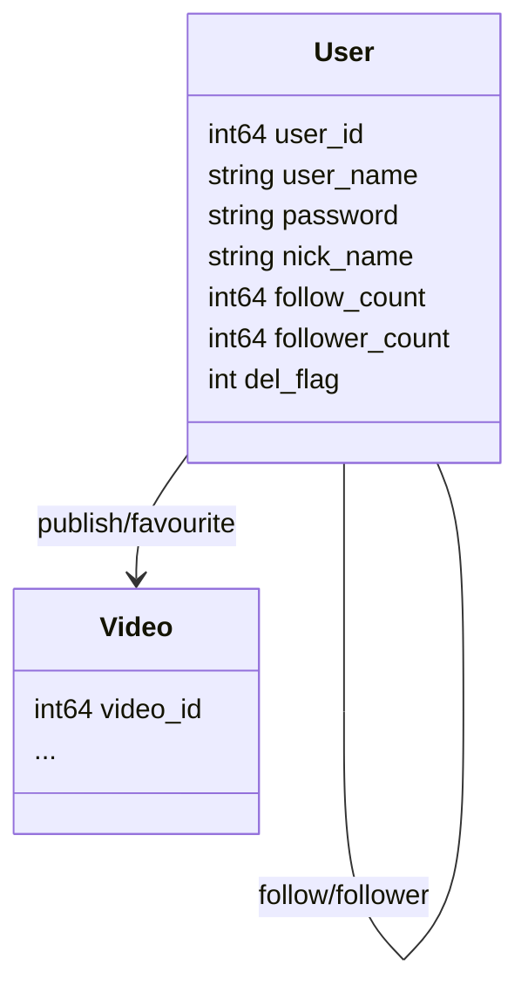
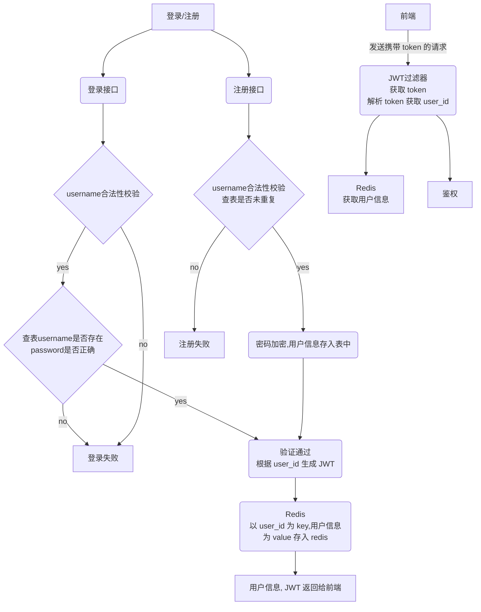

用户主页涉及接口：

- 注册POST /douyin/user/register/
- 登录POST /douyin/user/login/
- 用户信息GET /douyin/user/
- 发布列表 GET /douyin/publish/list/
- 喜欢列表 GET /douyin/favorite/list/
- 
#### 表设计

三张表：用户实体表，用户关系表，用户视频关系表

##### 类图



##### sql

```sql
/*
 Navicat Premium Data Transfer

 Source Server         : aliyun
 Source Server Type    : MySQL
 Source Server Version : 80026
 Source Host           : 121.199.78.94:3306
 Source Schema         : douyin

 Target Server Type    : MySQL
 Target Server Version : 80026
 File Encoding         : 65001

 Date: 18/01/2023 13:31:42
*/

SET NAMES utf8mb4;
SET FOREIGN_KEY_CHECKS = 0;

-- ----------------------------
-- Table structure for user
-- ----------------------------
DROP TABLE IF EXISTS `user`;
CREATE TABLE `user`  (
  `id` bigint(0) UNSIGNED NOT NULL AUTO_INCREMENT COMMENT '主键',
  `user_name` varchar(255) CHARACTER SET utf8 COLLATE utf8_general_ci NOT NULL COMMENT '用户名',
  `password` varchar(255) CHARACTER SET utf8 COLLATE utf8_general_ci NOT NULL COMMENT '密码',
  `nick_name` varchar(255) CHARACTER SET utf8 COLLATE utf8_general_ci NOT NULL COMMENT '昵称',
  `follow-count` bigint(0) NULL DEFAULT NULL COMMENT '关注数',
  `follower-count` bigint(0) NULL DEFAULT NULL COMMENT '粉丝数',
  `del_flag` int(10) UNSIGNED ZEROFILL NOT NULL COMMENT '删除标志（0代表未删除，1代表已删除）',
  PRIMARY KEY (`id`) USING BTREE
) ENGINE = InnoDB CHARACTER SET = utf8 COLLATE = utf8_general_ci ROW_FORMAT = Dynamic;

-- ----------------------------
-- Table structure for user_follow
-- ----------------------------
DROP TABLE IF EXISTS `user_follow`;
CREATE TABLE `user_follow`  (
  `follow_id` bigint(0) NOT NULL COMMENT '关注id',
  `follower_id` bigint(0) NOT NULL COMMENT '粉丝id',
  PRIMARY KEY (`follow_id`, `follower_id`) USING BTREE
) ENGINE = InnoDB CHARACTER SET = utf8 COLLATE = utf8_general_ci ROW_FORMAT = Dynamic;

-- ----------------------------
-- Table structure for user_video
-- ----------------------------
DROP TABLE IF EXISTS `user_video`;
CREATE TABLE `user_video`  (
  `user_id` bigint(0) NOT NULL COMMENT '用户id',
  `video_id` bigint(0) NOT NULL COMMENT '视频id',
  `status` int(0) NOT NULL COMMENT '视频状态（0自己的作品 1喜欢的别人作品）',
  PRIMARY KEY (`user_id`, `video_id`) USING BTREE
) ENGINE = InnoDB CHARACTER SET = utf8 COLLATE = utf8_general_ci ROW_FORMAT = Dynamic;

SET FOREIGN_KEY_CHECKS = 1;
```

#### 登录/注册流程


